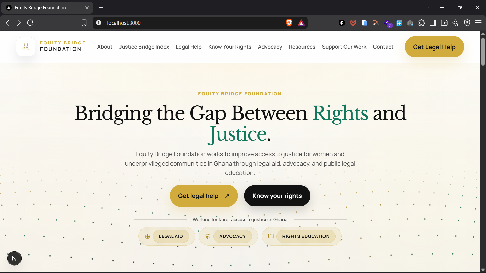

# Equity Bridge Foundation

An authoritative, modern, and accessible civic portal for **Equity Bridge Foundation** an independent human-rights and legal aid initiative dedicated to expanding access to justice for women and underserved communities across Ghana.



---

## Table of Contents

- [Overview](#overview)
- [Tech Stack](#tech-stack)
- [Design System & Aesthetics](#design-system--aesthetics)
- [Project Structure](#project-structure)
- [Getting Started](#getting-started)
  - [Prerequisites](#prerequisites)
  - [Installation](#installation)
  - [Running Locally](#running-locally)
  - [Building for Production](#building-for-production)
- [Security & Privacy (OWASP Compliance)](#security--privacy-owasp-compliance)
- [License](#license)

---

## Overview

Equity Bridge Foundation addresses structural access-to-justice challenges in Ghana through three primary pillars:
1. **Legal Aid:** Pro bono intake and guidance for vulnerable community members.
2. **Advocacy:** Evidence-based institutional engagement and public-interest advocacy.
3. **Public Legal Education:** Plain-language constitutional education and rights guidance.

---

## Tech Stack

- **Framework:** [Next.js 16](https://nextjs.org/) (App Router, Server Components & Streaming)
- **Runtime Library:** [React 19](https://react.dev/)
- **Language:** [TypeScript 5](https://www.typescriptlang.org/)
- **Styling:** CSS Custom Properties, HSL design token architecture, and [Tailwind CSS v4](https://tailwindcss.com/)
- **3D Motion & Shaders:** [Three.js](https://threejs.org/) for real-time procedural particle wave animations
- **Iconography:** [Lucide Icons](https://lucide.dev/) exclusively — zero informal emojis
- **Typography:** Google Fonts (`Libre_Baskerville` for display serifs, `Manrope` for clean sans-serif body)
- **Backend / CMS:** [Supabase](https://supabase.com/) with safe server-side fallbacks for continuous uptime

---

## Design System & Aesthetics

- **Tri-Color Signature Palette:**
  - **Deep Ink Black** (`hsl(0, 0%, 7%)`) — Authoritative typographic clarity and contrast
  - **Heritage Gold** (`hsl(45, 62%, 53%)`) — Warm civic prestige, trust, and prominence
  - **Royal Forest Emerald** (`hsl(164, 74%, 27%)`) — High-contrast Pan-African jewel tone symbolizing justice, renewal, and vitality
- **3D Dotted Surface Wave:**
  - Procedural Three.js particle lattice displaced by dual crossing sine waves
  - Tri-color particle harmonic distribution (Gold, Ink, and Emerald)
  - Vertical fade-in mask ensuring dots start strictly beneath the hero lede to maintain total typographic legibility
- **Mobile-First Responsiveness:**
  - Tested across mobile (375px), tablet (768px), laptop (1280px), and desktop (1920px) viewports
  - Fluid typography via CSS `clamp()`
  - High-contrast touch targets meeting and exceeding WCAG 2.1 AA/AAA accessibility standards (minimum 48px height)

---

## Project Structure

```
├── app/
│   ├── admin/                    # Admin portal, content management & intake triage
│   ├── advocacy/                 # Advocacy initiatives and public-interest campaigns
│   ├── api/                      # Protected contact and legal-help intake endpoints
│   ├── justice-bridge-index/     # Quarterly empirical access-to-justice publication
│   ├── know-your-rights/         # Plain-language constitutional and legal guides
│   ├── legal-help/               # Public legal-aid triage intake form
│   ├── globals.css               # Design tokens, keyframes, components, and media queries
│   ├── layout.tsx                # Root layout, fonts, and global metadata
│   └── page.tsx                  # Homepage with viewport-fitted full-bleed hero
├── components/
│   ├── ui/
│   │   └── dotted-surface.tsx   # Three.js 3D animated particle wave component
│   ├── site-header.tsx           # Sticky navigation with mobile drawer
│   ├── site-footer.tsx           # Civic footer, legal disclaimers, and links
│   └── ...
├── lib/
│   ├── public-content.ts         # Resilient server data helpers with CMS fallback
│   └── supabase-public-server.ts # Server-side Supabase client
└── public/                       # Static brand marks and media assets
```

---

## Getting Started

### Prerequisites
- Node.js 18.17 or higher
- npm 9 or higher

### Installation

```bash
# Clone the repository
git clone https://github.com/heisnature1/Equity-Foundation.git

# Navigate to the project root
cd Equity-Foundation

# Install dependencies
npm install
```

### Running Locally

```bash
# Start the local development server with Turbopack
npm run dev
```

Open [http://localhost:3000](http://localhost:3000) in your browser.

### Building for Production

```bash
# Type-check and build the optimized production bundle
npm run build

# Start the production server
npm start
```

---

## Security & Privacy (OWASP Compliance)

- **A01 Access Control:** Strict role segregation on all admin paths and protected routes.
- **A02 Cryptography:** Parameterized queries and HTTPS-only cookie policies.
- **A03 Injection Prevention:** Supabase client bindings eliminate SQL concatenation.
- **A04 Intake Validation:** Server-side triage schema sanitization for all legal-aid and contact requests.
- **A09 Logging:** Security event logging with complete redaction of sensitive personal data.

---

## License

All rights reserved © Equity Bridge Foundation.
